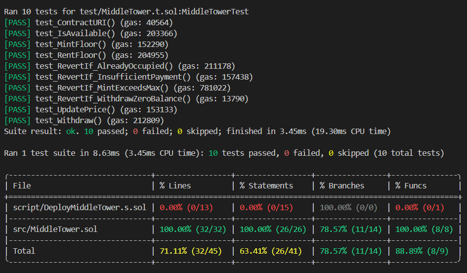

# 🏰 Middle Tower NFT Collection

  

[](https://soliditylang.org/)

[](https://book.getfoundry.sh/)

[](https://opensource.org/licenses/MIT)

[](#-testing)

  

A professional, production-ready **ERC721** token implementation using the **Foundry** development framework and **OpenZeppelin** standards. A smart contract-based decentralized ecosystem for managing and renting luxury tower units as NFTs. This tower is part of the **Aryana Island**.


---
  ## 🚀 Technical Stack & Tools

-   **Language:** Solidity ^0.8.20
    
-   **Framework:** [Foundry](https://book.getfoundry.sh/) (Forge & Cast)
    
-   **Library:** [OpenZeppelin (ERC721URIStorage, Ownable)](https://openzeppelin.com/contracts/)
    
-   **Network:** Polygon Amoy Testnet
---

## ✨ Key Features

-   **Limited Supply:** Strictly capped at 7 floors to maintain exclusivity.
    
-   **Dynamic Rental System:** Pay-per-day utility using native tokens (POL).
    
-   **Availability Tracking:** Real-time on-chain checks for floor occupancy.
    
-   **Foundry Powered:** Developed, tested, and deployed using the industry-standard Foundry framework.

  

---

  ## 📖 Smart Contract Logic

### Rental Flow:

1.  **Minting:** Only the owner can mint floors and set the daily rental price.
    
2.  **Renting:** Users can call `rentFloor` and send the required POL. The contract calculates the expiry based on `block.timestamp`.
    
3.  **Occupancy:** During the rental period, the floor is locked and cannot be rented by others until the `rentalExpiresAt` timestamp has passed.

---


## 🚀 Live Deployment (Amoy Testnet)

  

The contract is successfully deployed and live on the **Polygon Amoy Testnet**.

  

-  **Contract Address:** [`0xEDAbAB905dCd31f617074e1b7A94a0a490dF35E3`](https://amoy.polygonscan.com/address/0xEDAbAB905dCd31f617074e1b7A94a0a490dF35E3)

-  **Name:** Middle Tower

-  **Symbol:** MID

- **Network:** Polygon Amoy (Chain ID: 80002)

-  **Verified Contract:** [Click here to view on PolygonScan](https://amoy.polygonscan.com/address/0x0Fc2C3f40f27d27953669a98035156227384Bc6C#code) ✅

  

---

## 🧪 Testing & Quality Assurance

Security and reliability are the top priorities. The contract has been rigorously tested with **100% Line and Function coverage**.

### Run Tests:

```bash
forge test -vvvv
  ```
---

  

### Coverage Report:

```bash
forge coverage
  ```


---

  

## Installation & Usage

### Prerequisites

- Foundry
```bash
curl -L https://foundry.paradigm.xyz | bash && foundryup
```

  

---

  

### Clone & Build

```bash
git  clone https://github.com/alinasirlou2020/cultural-tower.git

cd  cultural-tower

forge  install

forge  build
```
---
## 📜 Deployment Script
The deployment is handled via Solidity scripts for idempotency and security.
```bash
forge script script/DeployMiddleTower.s.sol --rpc-url $AMOY_RPC_URL --private-key $PRIVATE_KEY --broadcast --verify
```
---
## 📜 License
This project is licensed under the **MIT License**.

## 📝 Overview


**Middle Tower** is a unique NFT collection where each token represents a specific floor in a 7-story tower. Beyond simple ownership, this contract introduces a **Native Rental Engine**, allowing owners to rent out their floors for a specific duration without complex escrow systems.

## Author
### Ali Nasirlou
Github : [`alinasirlou2020`](https://github.com/alinasirlou2020)
Linkedin : [`Ali Nasirlou`](https://www.linkedin.com/in/ali-nasirlou-14b6713b1/)